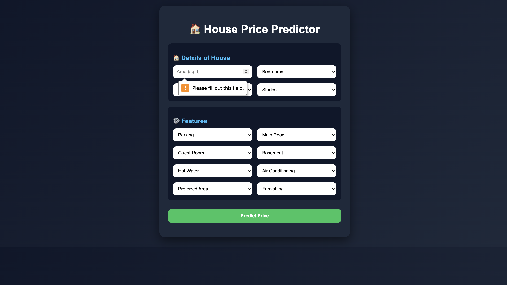
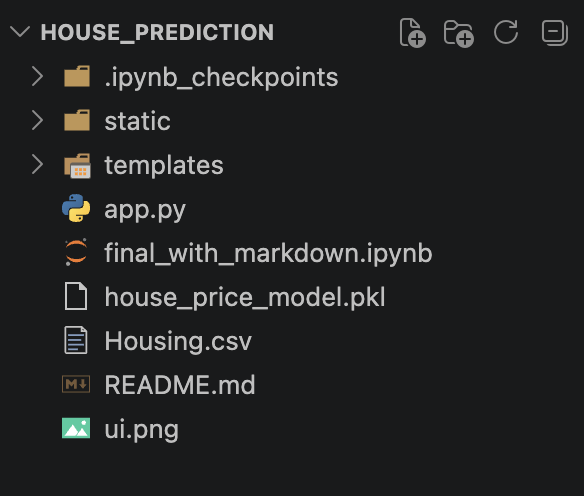

# 🏠 House Price Prediction Web App

A Machine Learning based web application that predicts house prices based on user inputs like area, bedrooms, bathrooms, and other features.

---

## 🚀 Features

- 📊 ML Model (Ridge Regression)
- 🧠 Feature Engineering included
- 🌐 Flask Backend API
- 🎨 Clean & Responsive UI (2-column layout)
- 💰 Price output in **Lakh / Crore format**

---

## 🖥️ UI Preview

---

## ⚙️ Tech Stack

- **Frontend:** HTML, CSS, JavaScript  
- **Backend:** Flask (Python)  
- **ML Libraries:** Pandas, NumPy, Scikit-learn  
- **Model:** Ridge Regression  

---

## 📁 Project Structure

  

<!--  -->
